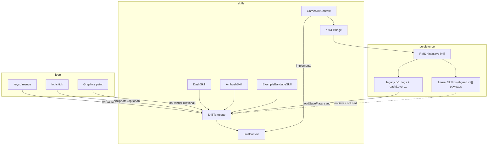

# Skill system abstraction (legacy-safe)

Goals: structured lifecycle for **new** skills without migrating dash/ambush/ticking paths in one shot. Boolean “learned” stays on `skillDashLearned`–style RMS flags until you append payload slots.

## Class design

### `SkillContext` (interface)

Facade over {@link `a`/bridge}. Skills **never** import `a` for field access beyond what context exposes — extend methods here when wiring new gameplay.

Recommended additions remain **optional**: each new getter is appended so old skills compile.

### `GameSkillContext`

Singleton `INSTANCE` forwarding to `a.skillBridge*` — unchanged role.

### `SkillTemplate` (abstract)

Single entry for activation stays **`tryActivate`** (MP + guards). Lifecycle hooks:

| Phase | Method | Default | Legacy note |
|--------|--------|---------|--------------|
| learned | `onLearn(ctx)` | calls `onLearned(ctx)` | Override `onLearned` still works (`DashSkill`, `AmbushSkill`) |
| use | `onActivate(ctx)` | abstract | unchanged |
| per-frame | `onUpdate(ctx, deltaMs)` | no-op | Optional; ticking skills may keep `TickingSkill` until migrated |
| paint | `onRender(ctx, g)` | no-op | Call from gameplay `paint` when skill visuals needed |
| end | `onExpire(ctx)` | no-op | Call when aura/buff/timer ends |
| RMS extra | `onSave()` / `onLoad(int[])` | `null` / no-op | **Does not replace** `getSaveFlag` / `loadSaveFlag` |

**Persistence contract**

- Bits like `skillDashLearned`, `dashLevel`, etc. remain in the frozen save buffer (`SaveLayout.md`).
- `onSave` / `onLoad` extend **skill-local** ints (charges, expiry tick, stacking) keyed by [`SkillIds`](src/SkillIds.java) append order — **never** reorder existing slots.

### `TickingSkill` (optional)

Existing dash path. New skills may implement both `extends SkillTemplate` + `implements TickingSkill` and delegate `tick` → `onUpdate` internally when you choose to unify.

---

## Dependency flow

**Call discipline**

1. **Learn**: quest/NPC calls `skill.learn(GameSkillContext.INSTANCE)` → `onLearn`.
2. **Activate**: UI/key → `tryActivate` → `onActivate`.
3. **Update**: game loop `(skill instanceof SkillTemplate)` → optional `template.onUpdate(ctx, dt)` if you introduce a dispatcher; ticking skills keep calling `tick` until migrated.
4. **Render**: from `paint` when skill is visually active → `onRender`.
5. **Expire**: combat/map code calls `onExpire` when timers end.
6. **Save/load**: after loading legacy flags per skill, optionally `skill.onLoad(registryLoadSlot(id))`; before save `slots = skill.onSave()`.

---

## Sample skill

See [`ExampleBandageSkill.java`](src/ExampleBandageSkill.java): learns with charge count, `onActivate` consumes one charge, persists charges via `onSave`/`onLoad` (**not wired** to RMS until you bump tail layout + `SkillIds`).
